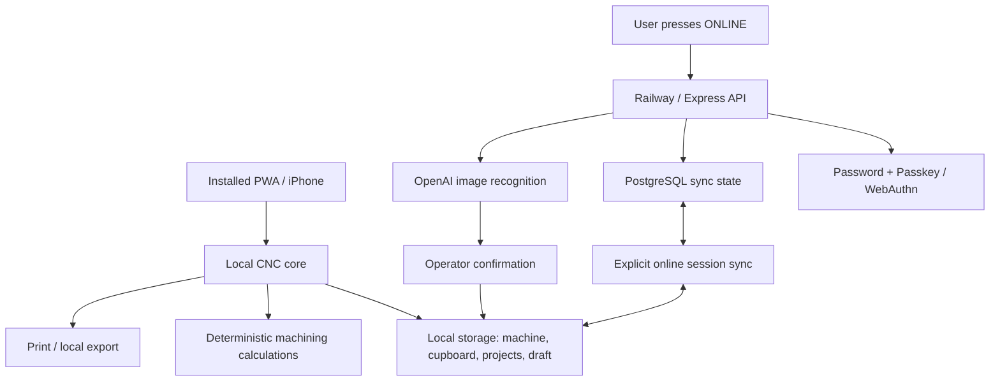

# CNC Copilot FULL 3.0.0 — Architecture

## Principle: local core, cloud on demand

CNC Copilot 3.0 is served from Railway when online, but the installed PWA is designed to continue from its service-worker cache when Railway or the shop network is unavailable. The browser does not automatically enable cloud functions.

## Modes

### Local
- Default after unlock.
- No `/api/*` calls are made by the CNC workflow.
- Calculations, material cards, operations, smart cupboard, projects, drawing requirements, references and the adaptive bottom Dock remain available.
- AI scanning is blocked.
- A previously enrolled Passkey can unlock the trusted device offline. The local profile stores the credential ID and its **public** COSE key; the private key remains inside the platform authenticator / secure hardware.

### Online
- Enabled only by the user from the top status control.
- Railway authentication/session becomes active.
- AI scanner and PostgreSQL synchronization become available.
- Local changes to machine/cupboard/projects are synchronized while this explicitly enabled session is active.
- If connectivity disappears, the UI drops back to Local mode instead of blocking the CNC core.

## Offline Passkey verification

The first trusted-device enrollment requires an online authenticated session. `/api/auth/me` returns the user's registered Passkey IDs plus their public COSE keys. Only those public values are cached locally.

Offline unlock:
1. Generates a fresh random WebAuthn challenge.
2. Requests `userVerification: required`.
3. Checks `type`, challenge and origin in `clientDataJSON`.
4. Checks the RP ID hash and UP/UV flags in authenticator data.
5. Verifies the assertion signature locally with Web Crypto.
6. Supports the algorithms allowed by the server: ES256 / P-256 and RS256.

This does not copy or expose the private Passkey key.

## Sync model

`GET /api/sync` returns the current user payload and revision.

`PUT /api/sync` stores:
- machine profile
- smart cupboard tools
- projects
- current draft

The current client merge keeps local versions for matching tool/project identities and adds remote-only records. The server increments a revision on every successful write.

## AI boundary

AI is outside the deterministic calculation core. Up to four photos can be sent through `/api/scan-insert`. AI produces an editable structured draft; the operator confirms it before saving to the cupboard. AI does not calculate cutting parameters.

## PWA boundary

`service-worker.js` caches the application shell and never intercepts `/api/` requests. This keeps local assets available offline without pretending that cloud API responses are local data.
