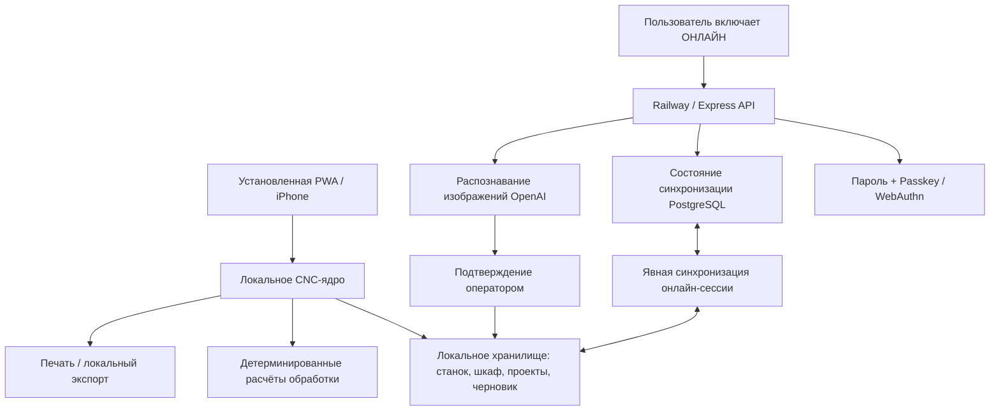

# CNC Copilot FULL 3.0.1 — архитектура

## Принцип: локальное ядро, облако по запросу

CNC Copilot обслуживается через Railway, когда сеть доступна, но установленная PWA продолжает работу из кэша service worker при отсутствии Railway или интернета в цеху. Браузер не включает облачные функции автоматически.

## Режимы

### Локальный
- Используется по умолчанию после разблокировки.
- CNC-процесс не выполняет запросы `/api/*`.
- Доступны расчёты, карточки материалов, операции, «Умный шкаф», проекты, требования чертежа, справочник и адаптивный нижний Dock.
- ИИ-сканирование заблокировано.
- Ранее зарегистрированный Passkey может разблокировать доверенное устройство без сети. Локальный профиль хранит идентификатор учётных данных и его **публичный** COSE-ключ; приватный ключ остаётся в защищённом аутентификаторе устройства.

### Онлайн
- Включается только пользователем через верхний индикатор состояния.
- Активируется серверная сессия Railway.
- Становятся доступны ИИ-сканер и синхронизация PostgreSQL.
- Изменения станка, шкафа и проектов синхронизируются только пока явно включена онлайн-сессия.
- При потере связи интерфейс возвращается в локальный режим и не блокирует CNC-ядро.

## Офлайн-проверка Passkey

Первая привязка доверенного устройства требует онлайн-сессии. `/api/auth/me` возвращает идентификаторы зарегистрированных Passkey и их публичные COSE-ключи. Локально сохраняются только публичные данные.

При офлайн-разблокировке приложение:
1. создаёт новый случайный challenge WebAuthn;
2. запрашивает `userVerification: required`;
3. проверяет `type`, challenge и origin в `clientDataJSON`;
4. проверяет хэш RP ID и флаги UP/UV в данных аутентификатора;
5. локально проверяет подпись через Web Crypto;
6. поддерживает разрешённые сервером алгоритмы ES256 / P-256 и RS256.

Приватный ключ Passkey не копируется и не раскрывается.

## Модель синхронизации

`GET /api/sync` возвращает текущий пакет пользователя и его ревизию.

`PUT /api/sync` хранит:
- профиль станка;
- инструменты «Умного шкафа»;
- проекты;
- текущий черновик.

Клиент при объединении сохраняет локальные версии совпадающих инструментов/проектов и добавляет записи, существующие только на сервере. После успешной записи сервер увеличивает ревизию.

## Граница ИИ

ИИ находится вне детерминированного расчётного ядра. До четырёх фотографий можно отправить через `/api/scan-insert`. ИИ формирует редактируемый черновик карточки, а оператор подтверждает его перед сохранением в шкаф. ИИ не рассчитывает режимы резания.

## Граница PWA

`service-worker.js` кэширует оболочку приложения и никогда не перехватывает запросы `/api/`. Поэтому локальные ресурсы доступны без сети, а облачные ответы не маскируются под локальные данные.
