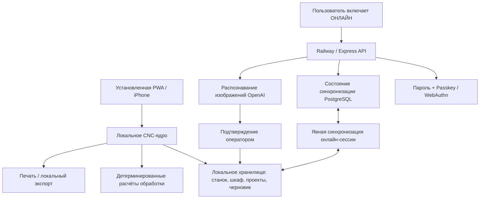

# CNC Copilot FULL 3.0.1 — архитектура

## Принцип: локальное ядро, облако по запросу

CNC Copilot обслуживается через Railway, когда сеть доступна, но установленная PWA продолжает работу из кэша service worker при отсутствии Railway или интернета в цеху. Браузер не включает облачные функции автоматически.

## Режимы

### Локальный
- Используется по умолчанию после разблокировки.
- CNC-процесс не выполняет запросы `/api/*`.
- Доступны расчёты, карточки материалов, операции, «Умный шкаф», проекты, требования чертежа, справочник и адаптивный нижний Dock.
- ИИ-сканирование заблокировано.
- Ранее зарегистрированный Passkey может разблокировать доверенное устройство без сети. Локальный профиль хранит идентификатор учётных данных и его **публичный** COSE-ключ; приватный ключ остаётся в защищённом аутентификаторе устройства.

### Онлайн
- Включается только пользователем через верхний индикатор состояния.
- Активируется серверная сессия Railway.
- Становятся доступны ИИ-сканер и синхронизация PostgreSQL.
- Изменения станка, шкафа и проектов синхронизируются только пока явно включена онлайн-сессия.
- При потере связи интерфейс возвращается в локальный режим и не блокирует CNC-ядро.

## Офлайн-проверка Passkey

Первая привязка доверенного устройства требует онлайн-сессии. `/api/auth/me` возвращает идентификаторы зарегистрированных Passkey и их публичные COSE-ключи. Локально сохраняются только публичные данные.

При офлайн-разблокировке приложение:
1. создаёт новый случайный challenge WebAuthn;
2. запрашивает `userVerification: required`;
3. проверяет `type`, challenge и origin в `clientDataJSON`;
4. проверяет хэш RP ID и флаги UP/UV в данных аутентификатора;
5. локально проверяет подпись через Web Crypto;
6. поддерживает разрешённые сервером алгоритмы ES256 / P-256 и RS256.

Приватный ключ Passkey не копируется и не раскрывается.

## Модель синхронизации

`GET /api/sync` возвращает текущий пакет пользователя и его ревизию.

`PUT /api/sync` хранит:
- профиль станка;
- инструменты «Умного шкафа»;
- проекты;
- текущий черновик.

Клиент при объединении сохраняет локальные версии совпадающих инструментов/проектов и добавляет записи, существующие только на сервере. После успешной записи сервер увеличивает ревизию.

## Граница ИИ

ИИ находится вне детерминированного расчётного ядра. До четырёх фотографий можно отправить через `/api/scan-insert`. ИИ формирует редактируемый черновик карточки, а оператор подтверждает его перед сохранением в шкаф. ИИ не рассчитывает режимы резания.

## Граница PWA

`service-worker.js` кэширует оболочку приложения и никогда не перехватывает запросы `/api/`. Поэтому локальные ресурсы доступны без сети, а облачные ответы не маскируются под локальные данные.

## FULL 3.1 · WIP-04 verified machine envelope
The CK52PT-Y machine profile now carries separate limits for the machine spindle setting, the verified BK-1552 rotating hydraulic cylinder, the Siemens 1PH8137 motor and an optional current chuck/jaw setup. The effective G96/LIMS value is always the minimum valid limit. Power limiting uses a conservative 17 kW continuous calculation base while retaining all 17–24 kW S1 nameplate points as metadata; 24 kW is not treated as constant spindle power until the motor-to-spindle transmission is confirmed.

## FULL 3.1 · WIP-05 guided result verification
The result stage is machine-side and sequential. `state.resultCursor` selects one result group at a time. A future operation is unlocked only when every pass of all previous result groups has `verified=true`. Feedback other than `good` proposes S/f/ap changes for the active pass only; applying the proposal clears verification and increments the local revision. When the active operation is fully verified, the next operation becomes available (and auto-opens after the final pass is confirmed). This layer does not alter the core cutting formulas.

### WIP-06 interaction layer
Guided Workflow animation is deliberately presentation-only. `goStep()` still owns validation and state transitions; `syncGuidedChrome()` only updates progress UI, scroll position and temporary CSS classes. Material progressive disclosure is similarly UI-only: stock inputs remain the same IDs and feed the same `readStock()` / calculation path. No machining formula was changed for WIP-06.

### WIP-07: end-to-end guardrails
Guided Workflow теперь имеет два последовательных шлюза: геометрия операций заполняется строго по порядку, а результат подтверждается по порядку проходов и операций. Планировщик припуска связывает «сырьё → чертёж» с физическим количеством проходов; локальная коррекция режима повторно планирует ap/count, не затрагивая остальные операции.

### WIP-08: separate tool identity per pass
A turning route now carries `roughToolId` and `finishToolId` in addition to the legacy/single-pass `toolId`. `routeToolChoice()` resolves the pass-specific assignment and `recommendTool()` applies a strict compatibility gate (`ISO + operation + pass`). A rough-only WNMG can no longer be returned for a finishing pass. Route validation includes `routeToolPlanReady()`, so calculation cannot start with a missing pass tool. Legacy local cupboard records created before pass-role confirmation are marked unconfirmed and are excluded from rough/finish auto-selection until the operator explicitly classifies them as rough, finish, or both.
